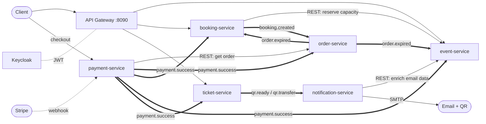

# tickets-microservice

Distributed event-driven ticketing platform built with Spring Boot, Kafka & Keycloak.

[▶️ Live API Docs](https://docs.plazaleon.tech)

## Tech Stack

- **Java 21 / Spring Boot 3**
- Kafka & Schema Registry
- PostgreSQL + Flyway
- Stripe (payment sessions)
- Keycloak (JWT auth)
- Docker & Docker Compose

## 🏗 Architecture



> **Thick arrows** are Kafka topics (`tickets.*`), published through a **transactional outbox** wherever the producer owns a database; thin arrows are synchronous REST, dotted arrows are external integrations. Every consumer is **idempotent** and every topic has a **dead-letter topic** with exponential backoff. Each service owns its own schema in a single PostgreSQL instance; Redis backs caching and the order-expiry schedule.
>
> See **[docs/architecture.md](./docs/architecture.md)** for the full purchase sequence diagram and the order lifecycle.

## Monorepo layout

| Folder                     | Responsibility                                                                                                                                                                                                                 | Key interactions                                              | Docs                                          |
|----------------------------|--------------------------------------------------------------------------------------------------------------------------------------------------------------------------------------------------------------------------------|---------------------------------------------------------------|-----------------------------------------------|
| **`apigateway`**           | Public entry-point (Spring Cloud Gateway MVC). Routes traffic, enforces global filters, and propagates `X-User-Id` & `X-Correlation-Id` headers for end-to-end tracing.                                                        | ↔︎ All services via REST • Auth with Keycloak                 | [▶](https://tickets-api.bump.sh/apigateway)   |
| **`booking-service`**      | Creates **temporary ticket holds** (soft-reserve) and persists bookings. Calls `event-service` to check capacity, then emits `BookingCreatedEvent` to Kafka (`tickets.booking.created`).                                       | ↔︎ `event-service` (REST) • ↔︎ `order-service` (Kafka)        | [▶](https://tickets-api.bump.sh/booking)      |
| **`event-service`**        | Manages events, venues, categories & ticket types. Tracks remaining capacity and updates counts on hold, sale, release or transfer. Publishes `CapacityUpdatedEvent`.                                                          | ↔︎ `booking` / `order` / `ticket` (REST + Kafka)              | [▶](https://tickets-api.bump.sh/event)        |
| **`order-service`**        | Consumes `BookingCreatedEvent`, creates orders (`PENDING_PAYMENT` ➜ `PAID` ➜ `CANCELLED`). Schedules expiration (`OrderExpiredEvent`) and emits `PaymentRequestedEvent`.                                                       | ↔︎ `payment-service` (Kafka) • ↔︎ `booking`/`event` (Kafka)   | [▶](https://tickets-api.bump.sh/order)        |
| **`payment-service`**      | Integrates with Stripe to create checkout sessions and webhooks. Emits `PaymentSucceededEvent` & `PaymentFailedEvent`.                                                                                                         | ↔︎ Stripe (HTTP) • ↔︎ `order` / `event` / `ticket` (Kafka)    | [▶](https://tickets-api.bump.sh/payment)      |
| **`ticket-service`**       | Generates and signs **QR codes** (per-ticket + master QR for entire order), validates scans, and handles ticket transfers between users. Emits `TicketQrReadyEvent`.                                                           | ↔︎ `notification-service` (Kafka) • ↔︎ `event-service` (REST) | [▶](https://tickets-api.bump.sh/ticket)       |
| **`notification-service`** | Listens for `PaymentSucceededEvent` & `TicketQrReadyEvent` to send transactional emails (PDF/PNG QR attachments) via SMTP provider.                                                                                            | ↔︎ `ticket` / `order` / `payment` (Kafka) • ↔︎ SMTP           | [▶](https://tickets-api.bump.sh/notification) |
| **`shared-events`**        | Maven module with **versioned Avro/JSON schemas** and Java records for Kafka events (`BookingCreatedEvent`, `OrderExpiredEvent`, etc.). Imported as a dependency by all other services to enforce contract-driven development. | —                                                             | *(n/a)*                                       |
| **`docker`**               | Docker Compose files for local development (Kafka, Zookeeper, PostgreSQL, Keycloak, Stripe CLI).                                                                                                                               | —                                                             | —                                             |
| **`deploy`**               | (under construction) Helm charts / Kustomize overlays for staging & production (Kubernetes).                                                                                                                                   | —                                                             | —                                             |
| **`docs`**                 | Architecture diagrams, ADRs, and additional Markdown documents referenced by the README.                                                                                                                                       | —                                                             | —                                             |

## ✅ Requirements

Install the following tools before you run or contribute to **tickets-microservice**.  
(*Items marked **optional** are only needed for specific tasks.*)

- **Java 21 or newer** – required by every Spring Boot service
- **Maven 3.9 +** – build system (`./mvnw` wrapper is included)
- **Docker 20 +** – container runtime for all services
- **Docker Compose v2 +** – spins up the full stack locally
- **Stripe CLI (latest)** – *optional*, to test webhooks for `payment-service`

## 🚀 Quick Start

### 1 ▸ Clone the repository

```bash
git clone https://github.com/darioplazaleon/tickets-microservice.git
cd tickets-microservice
```

### 2 ▸ Configure environment variables

Copy the template and fill in your secrets:

```bash
cp .env.example .env
```

### 3 ▸ Build & start the full stack

```bash
docker compose --profile app up -d --build
```

> To start **only the infrastructure** (and run the services from your IDE), drop the profile: `docker compose up -d`

| Service                    | URL / Port                        |
|----------------------------|-----------------------------------|
| **API Gateway**            | <http://localhost:8090>           |
| **Keycloak Admin Console** | <http://localhost:8091/admin>     |
| **PostgreSQL**             | `localhost:5432` (`POSTGRES_PORT`)|
| **Kafka UI**               | <http://localhost:8084>           |
| **Prometheus**             | <http://localhost:9090>           |
| **Grafana**                | <http://localhost:3000>           |

### 4 ▸ Verify everything is running

All containers should display healthy logs in your terminal.  
Open Swagger UI or hit endpoints with Postman / cURL to confirm.

> ℹ️ Each microservice also publishes detailed OpenAPI specs on Bump.sh — see **Monorepo layout** for direct links.
