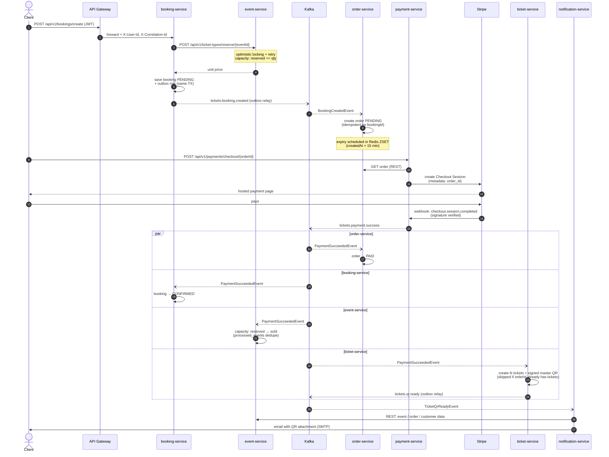
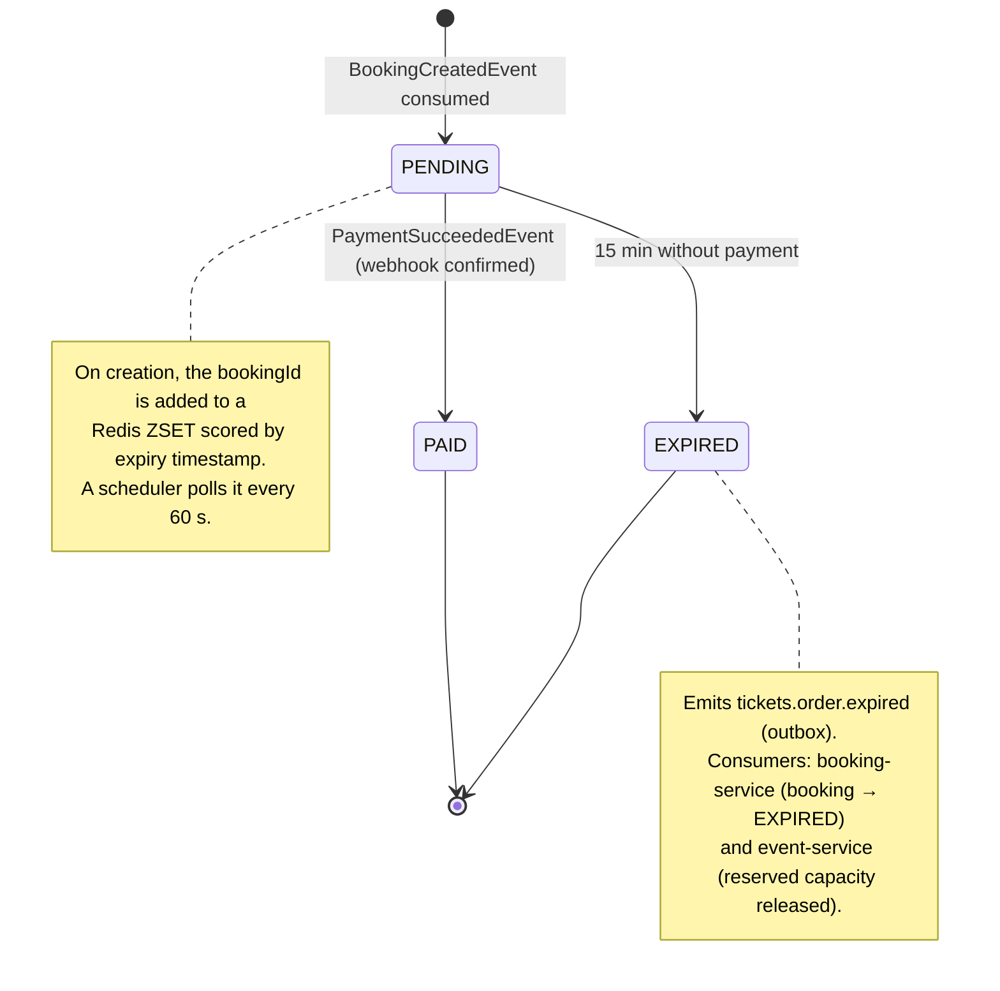

# Architecture

This document zooms into the two flows that define the system: the **purchase happy path** and the **order lifecycle** (including what happens when the user never pays). For the high-level component view, see the diagram in the [README](../README.md#-architecture).

## Purchase flow (happy path)

The services are choreographed through Kafka events — there is no central orchestrator. Each arrow annotated with a topic name is an asynchronous event; everything else is synchronous REST.

Notes on the numbered steps:

- **6–7 (outbox):** services that own a database never call `kafkaTemplate.send()` inside business logic. The event is written to an `outbox_events` table in the same transaction as the state change, and a scheduled relay publishes it in order. If the broker is down, the business transaction still commits and the event goes out later. `payment-service` is the exception — it has no database, so it publishes directly.
- **18 (fan-out):** `tickets.payment.success` has four consumer groups, each processing independently. Kafka delivers *at-least-once*, so every handler is idempotent: `order`/`booking` guard by current state, `ticket` checks `existsByOrderId`, and `event` deduplicates through a `processed_events` table (its capacity counters have no natural idempotency key).
- **QR signing:** each QR payload is signed with HMAC-SHA256 (`QR_SECRET_KEY`), so `ticket-service` can validate scans offline without a database lookup of the signature.
- **Failure handling:** every listener sits behind a `DefaultErrorHandler` with exponential backoff (3 retries, 1s→10s) and a `<topic>.DLT` dead-letter topic. Corrupt payloads skip retries and go straight to the DLT via `ErrorHandlingDeserializer`.

## Order lifecycle

An order is born when `booking.created` is consumed and dies either paid or expired. Expiration is not event-driven from the outside — `order-service` schedules it itself in a Redis sorted set and sweeps it with a scheduler.

The booking mirrors these transitions on its side: `PENDING → CONFIRMED` on payment success, `PENDING → EXPIRED` on order expiry. The ZSET entry is removed only *after* the expiration is processed — if the service dies mid-sweep, the next tick retries it (`expireByBookingId` is idempotent).

## Where to look in the code

| Concern | Entry point |
|---|---|
| Capacity reservation (optimistic locking + retry) | `eventservice · TicketTypeService.reserveTickets` |
| Transactional outbox (writer + relay) | `shared-infra · OutboxEventWriter`, `OutboxRelay` |
| Idempotent payment fan-out | `ticketservice · TicketOwnershipService.processPayment` |
| Order expiration sweep | `orderservice · OrderExpirationScheduler` |
| Retry / DLT policy | `shared-infra · SharedKafkaAutoConfiguration` |
| Stripe webhook verification | `paymentservice · WebHookController` |
